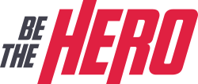

<h1 align="center">
  &nbsp;&nbsp;&nbsp;&nbsp;&nbsp;&nbsp;&nbsp;
  
</h1>

<h3 align="center">
🚀 <br>
First participation in the OmniStack 11.0 intensive - <a href="https://rocketseat.com.br/">RocketSeat</a>
</h3>

<p align="center">
  
  
  

  
  
  

  <br>

  

  

  
</p>

<br>

### 📝 About the project
An application where the objective is to find people in order to contribute to ONGs in need of help for any cause that has occurred. On the WEB platform, ONGs can register informing the cause with their details and cost value, in the MOBILE application they will find registered ONGs and select one (or more) cases that want to contribute to help.

<div align="center">
  &nbsp;&nbsp;&nbsp;&nbsp;&nbsp;&nbsp;&nbsp;&nbsp;&nbsp;&nbsp;&nbsp;&nbsp;&nbsp;&nbsp;&nbsp;&nbsp;&nbsp;&nbsp;&nbsp;&nbsp;
  
</div>

<br>

## 🤖 Back-End
The Back-End was developed with Node.JS, in API Rest format.
The connection to the PostgreSQL database was made with KnexJS.

### 🛠 Technologies
- **[Node.JS](https://nodejs.org/en/)**
- *[Express](https://expressjs.com/pt-br/)*
- *[Nodemon](https://nodemon.io/)*
- *[Knex.JS](http://knexjs.org/)*

<br>

## 🖥 Front-End
The Front-End was developed with React.JS. The navigation screens were made with React Router DOM. To connect with the Back-End, Axios was used.

### 🛠 Technologies
- **[React.JS](https://reactjs.org/)**
- *[React Router DOM](https://reacttraining.com/react-router/web/guides/quick-start)*
- *[Axios](https://nodemon.io/)*

<br>

## 📱 Mobile
The Mobile was developed with React Native using Expo to build the application. The navigation screens were made with React Router DOM. To connect with the Back-End, Axios was used.

### 🛠 Technologies
- **[React Native](https://reactnative.dev/)**
- *[Expo](https://expo.io/)*
- *[React Navigation](https://reactnavigation.org/)*
- *[Axios](https://nodemon.io/)*

<br>

## 🏁 Starting the project
Clone the project: `git clone https://github.com/leopacciulli/OmniStack11-BeTheHero.git`

<br>

🤖 To run the **Back-End**, (run in the port 3333)
<br>Then open the terminal and run the following commands:

````zsh
# to enter the Back-End folder
$ cd backend

# to download the dependencies
$ yarn

# to start the application on port 3333
$ yarn start
````
<br>

🖥 To run the **Front-End**, in another terminal tab, execute the following commands:

````zsh
# to enter the Front-End folder
$ cd frontend

# to download the dependencies
$ yarn

# to start the application on port 3000
$ yarn start
````
<br>

📱 To run **Mobile**, you need an Android or iOS simulator (Mac only) running on your computer or connect your physical smartphone to USB. To learn how to install / configure, follow the [RocketSeat tutorial](https://blog.rocketseat.com.br/expo-react-native/).
<br>Now, on another tab of the terminal, run the following commands:

````zsh
# to enter the Mobile folder
$ cd mobile

# to download the dependencies
$ yarn

# to run openning the Expo on your browser
$ yarn start

# OR to start the app on the simulator or on the Android physical smartphone connected to the USB device
$ yarn android

# OR to launch the app on the simulator or on the physical iOS smartphone connected to the USB device (only using Mac)
$ yarn ios
````


---


<h3 align="center">
  Made with love by 💙 Leonardo Pacciulli
</h3>

<p align="center">
  <a href="https://www.linkedin.com/in/leonardo-pacciulli">
    
  </a>
  <a href="https://www.facebook.com/paculli">
    
  </a>
  <a href="https://www.instagram.com/leopacciulli/">
    
  </a>
</p>